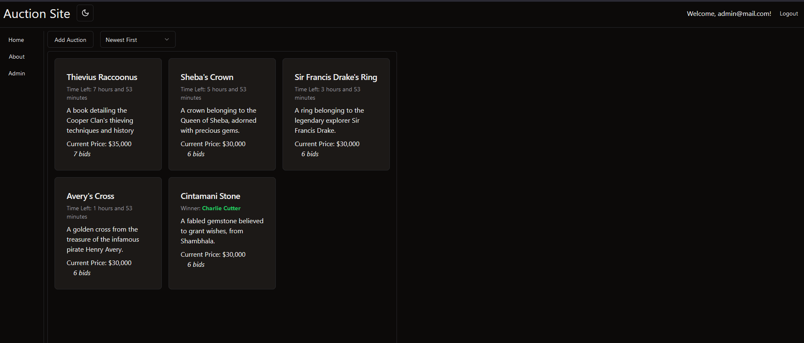
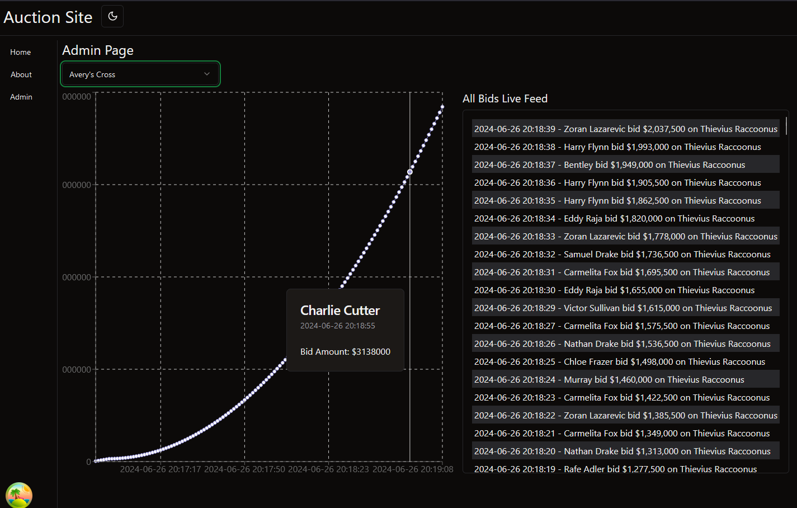

Just goofing around with kafka and ksqldb.

Uses KsqlDB and WebSockets to send live updates to the frontend.

Requires Docker Desktop to run.

## docker-compose.py

Allows you to run `docker-compose` commands with the option to exclude specific containers.

Made since the kafka containers need time to start before the .Net backend can connect.

### Usage

To run all the containers and delay starting the auctionBackend:

```bash
python docker-compose.py --build --delay auctionBackend 20
```

## Important URLS:

Frontend: `localhost:8083`

Backend REST API overview: `localhost:8081/swagger`

Kafka UI: `localhost:8080`

# Showcase

## Main Page



## Auction page


## Admin Page


